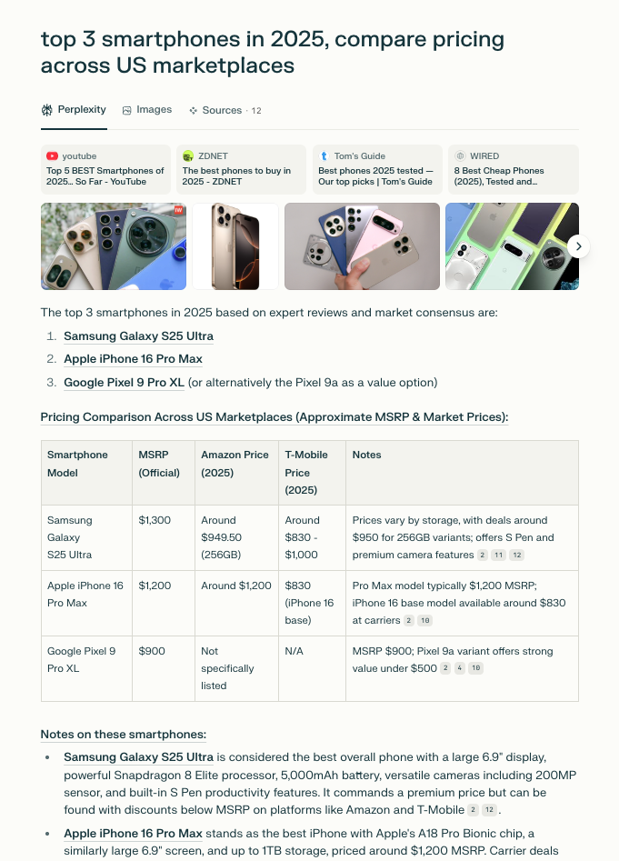
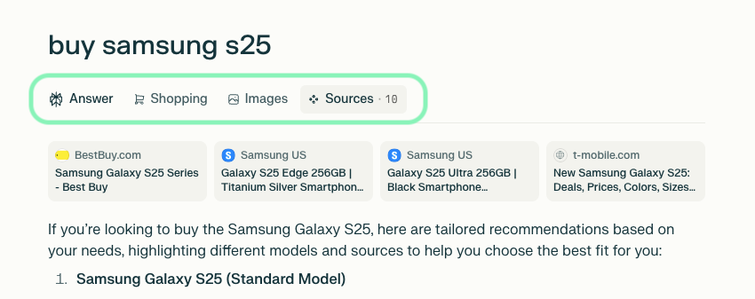
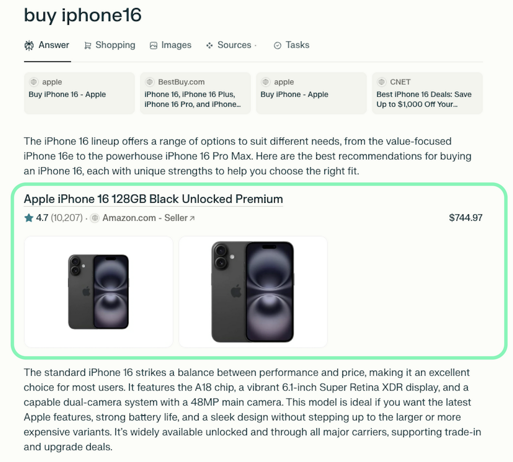

# Perplexity Scraper

[](https://oxylabs.io/products/scraper-api/serp/perplexity?utm_source=877&utm_medium=affiliate&utm_campaign=llm_scrapers&groupid=877&utm_content=perplexity-scraper-github&transaction_id=102f49063ab94276ae8f116d224b67)

[](https://discord.gg/Pds3gBmKMH) [](https://www.youtube.com/@oxylabs)


The [Perplexity Scraper](https://oxylabs.io/products/scraper-api/serp/perplexity) by Oxylabs allows developers to send prompts to Perplexity and automatically collect both AI-generated responses and structured metadata. Instead of just raw HTML, it can also provide results as parsed JSON, website PNG, XHR/Fetch requests, or Markdown output. 

You can use the [Oxylabs’ Web Scraper API](https://oxylabs.io/products/scraper-api) with Perplexity for AI content auditing, research tracking, and analyzing SEO performance. It handles dynamic AI-generated content, fully supports real-time SERP extraction, and integrates seamlessly with Oxylabs' global proxy infrastructure, without the need to manage proxies, browsers, or worry about anti-bot systems.

## How it works

The Perplexity scraper handles the rendering, parsing, and delivery of results in any requested format. You need to provide your prompt, credentials, and a few optional parameters, as shown below.

### Request sample (Python)

```python
import json
import requests

# API parameters.
payload = {
    'source': 'perplexity',
    'prompt': 'top 3 smartphones in 2025, compare pricing across US marketplaces',
    'geo_location': 'United States',
    'parse': True
}

# Get a response.
response = requests.post(
    'https://realtime.oxylabs.io/v1/queries',
    auth=('USERNAME', 'PASSWORD'),
    json=payload
)

# Print response to stdout.
print(response.json())

# Save response to a JSON file.
with open('response.json', 'w') as file:
    json.dump(response.json(), file, indent=2)
```

More request examples in different programming languages are available [here](https://github.com/oxylabs/perplexity-scraper/tree/main/Code%20examples).

**Note:** By default, all requests to Perplexity use JavaScript rendering. Make sure to set a sufficient timeout (e.g. 180s) when using the Realtime integration method.

### Request parameters

| Parameter | Description | Default value |
|-----------|-------------|---------------|
| `source`* | Sets the Perplexity scraper | `perplexity` |
| `prompt`* | The prompt or question to submit to Perplexity. | – |
| `parse` | Returns parsed data when set to true. | `true` |
| `geo_location` | Specify a country to send the prompt from. [More info](https://developers.oxylabs.io/scraping-solutions/web-scraper-api/features/localization/proxy-location). | – |
| `callback_url` | URL to your callback endpoint. [More info](https://developers.oxylabs.io/scraping-solutions/web-scraper-api/integration-methods/push-pull#callback). | – |

\* Mandatory parameters

---

### Output samples

Web Scraper API returns either an HTML document or a JSON object of Perplexity scraper output, which contains structured data from the results page.

**HTML example:**



**Structured JSON output snippet:**

```json
{
    "results": [
        {
            "content": {
                "url": "https://www.perplexity.ai/search/top-3-smartphones-in-2025-comp-wvA0dso7TgW3NpgF8Jd8tg",
                "model": "turbo",
                "top_images": ["url + title"],
                "top_sources": ["url + title + source"],
                "prompt_query": "top 3 smartphones in 2025, compare pricing across US marketplaces",
                "answer_results": ["answer in JSON"],
                "displayed_tabs": [
                    "search",
                    "images",
                    "sources"
                ],
                "related_queries": [                
                    "How do the prices of the top 3 smartphones compare across US marketplaces",
                    "What features make the Galaxy S25 Ultra stand out as the best in 2025",
                    "Why is the Pixel 9a considered a top budget option despite its lower price",
                    "How does the iPhone 16 Pro Max's pricing differ from Samsung and Google models",
                    "What factors should I consider when choosing among these top smartphones in 2025"
                ],
                "answer_results_md": ["answer in Markdown"],
                "parse_status_code": 12000
            },
            "created_at": "2025-07-16 12:14:32",
            "updated_at": "2025-07-16 12:15:28",
            "page": 1,
            "url": "https://www.perplexity.ai/search/top-3-smartphones-in-2025-comp-wvA0dso7TgW3NpgF8Jd8tg",
            "job_id": "7351222707934990337",
            "is_render_forced": false,
            "status_code": 200,
            "parser_type": "perplexity",
            "parser_preset": null
        }
    ]
}
```

You can find the full output example file [here](output-perplexity-scraper.json) in this repository.  

Alternatively, you can extract the data in the Markdown format for easier data integration workflows involving AI tools.

## JSON output structure

Structured Perplexity scraper output includes fields such as `url`, `model`, `answer_results`, and more. The table below breaks down the page elements we parse, along with descriptions, data types, and relevant metadata.

**Note:** The number of items and fields for a specific result type may vary depending on the submitted prompt.

| Field | Description | Type |
|-------|-------------|------|
| `url` | The URL of Perplexity's conversation. | string |
| `page` | Page number. | integer |
| `content` | An object containing parsed Perplexity page data. | object |
| `model` | Perplexity model used to generate the answer. | string |
| `prompt_query` | The original prompt submitted to Perplexity. | string |
| `displayed_tabs` | Tabs displayed in Perplexity's interface (e.g., shopping, images). | list |
| `answer_results` | The complete Perplexity response containing text or nested content. | list/string |
| `answer_results_md` | The entire answer rendered in Markdown format. | string |
| `related_queries` | A list of queries related to the main prompt. | list |
| `top_images` | A list of top images with their titles and URLs. | array |
| `top_sources` | A list of top cited sources with their titles, sources, and URLs. | array |
| `inline_products` | A list of inline products with titles, prices, links, and other metadata. | array |
| `additional_results.hotels_results` | A list of hotels with titles, URLs, addresses, and other hotel details. | array |
| `additional_results.places_results` | A list of places with titles, URLs, coordinates, and other metadata. | array |
| `additional_results.videos_results` | A list of videos with thumbnails, titles, URLs, and sources. | array |
| `additional_results.shopping_results` | A list of shopping items with titles, prices, URLs, and other product metadata. | array |
| `additional_results.sources_results` | A list of cited sources with their titles and URLs. | array |
| `additional_results.images_results` | A list of related images with titles, image URLs, and source page URLs. | array |
| `parse_status_code` | Status code of the parsing operation. | integer |
| `created_at` | The timestamp when the scraping job was created. | timestamp |
| `updated_at` | The timestamp when the scraping job was finished. | timestamp |
| `job_id` | The ID of the job associated with the scraping job. | string |
| `geo_location` | Proxy location from which the prompt was submitted. | string |
| `status_code` | The status code of the scraping job. [More info](https://developers.oxylabs.io/scraping-solutions/web-scraper-api/response-codes). | integer |
| `parser_type` | The type of the parser used for breaking down the HTML content. | string |

## Additional results and inline products

Along with the main AI response, the Perplexity scraper can return extra data under `additional_results`, such as:

- `images_results`
- `sources_results`
- `shopping_results`
- `videos_results`
- `places_results`
- `hotels_results`

These arrays are extracted from the tabs on the original results page and are included only if relevant content is available:



Moreover, the `inline_products` array contains products that are directly embedded in the response:



## Practical Perplexity scraper use cases

1. **AI content auditing:** Compare quality, consistency, and reliability of Perplexity-generated responses.  
2. **Research tracking:** Monitor how Perplexity summarizes or interprets information across time.  
3. **SEO performance comparison:** Track your brand mentions and content rankings to optimize your visibility strategies.  

## Why choose Oxylabs?

- **Superior success rates:** Experience the most reliable scraping even on high-profile and dynamic AI-driven sources.  
- **Maintenance-free:** Our API handles all the infrastructure, from proxy management to IP rotation and anti-bot systems.  
- **Dedicated support:** Get expert help whenever needed, from integration to debugging.  

## FAQ

### Is scraping Perplexity AI allowed?

Perplexity does not provide a public API for all its features, so scraping falls into a gray area depending on its Terms of Service. We recommend reviewing their policies carefully and ensuring compliance. Oxylabs provides the technical capability, but it’s up to you to use it responsibly and in line with applicable regulations.

### Does the scraper return only JSON?

No, the Perplexity scraper can return multiple formats depending on your needs. The scraper can return results as raw HTML, structured JSON, Markdown output, website PNG, or capture XHR/Fetch requests.

### What’s the recommended timeout for real-time requests?

Since Perplexity responses are dynamically generated, requests can take longer than standard web scraping. We recommend setting a timeout of at least 180 seconds when using the Realtime integration method to avoid incomplete results. For larger or more complex prompts, consider asynchronous methods like Push-Pull.

## Learn more

For a deeper dive into available parameters, advanced integrations, and additional examples, check out the [Perplexity Scraper documentation](https://developers.oxylabs.io/scraping-solutions/web-scraper-api/targets/perplexity).

## Contact us

If you have questions or need support, reach out to us at support@oxylabs.io, or through live chat, accessible via [Oxylabs Dashboard](https://dashboard.oxylabs.io/en/), or join our [Discord community](https://discord.gg/Pds3gBmKMH). For enterprise-related inquiries, contact your dedicated account manager.
